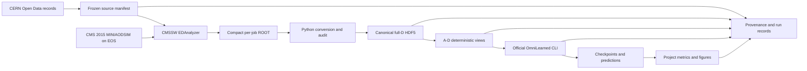

# ParticleML Software Architecture Design

## Document Status

| Field | Value |
|---|---|
| Status | Architecture baseline; implementation not yet verified |
| Version | 1.0 |
| Date | 2026-07-13 |
| Language | English |
| Primary study | CMS 2015 top-versus-QCD feature-availability fine-tuning |
| Model | Official OmniLearned PET-style pretrained model |

This design combines the controlled fine-tuning protocol in
[Research Plan v0.4](../research/research-plan.md) with the data and
operations findings in
[CMS 2015 MINIAODSIM Feasibility Analysis](../research/assessments/cms-2015-miniaodsim-feasibility.md).
It supersedes the planned folder layout in the repository README for formal
experiment code. The existing JetClass notebook remains preparation material
and is not a production dependency.

The CMS feasibility report is `ANALYZED`, not `VERIFIED`. This architecture
therefore treats CMSSW extraction, decoded impact-parameter values, truth
matching, and signal yield as explicit E0 gates rather than completed work.

## 1. Purpose and Scope

The software must answer one controlled research question:

> Under a fixed CMS 2015 top-versus-QCD fine-tuning protocol, how does nested
> particle-level feature availability affect a pretrained OmniLearned model?

The formal pipeline must:

1. extract reconstructed AK8 jets and packed constituents from the frozen CMS
   2015 MINIAODSIM corpus;
2. assign leakage-safe signal and background labels;
3. create one immutable canonical particle dataset containing the full D
   schema and provenance;
4. derive A-D training views from that canonical dataset without changing jet
   membership, particle order, masks, or splits;
5. fine-tune and evaluate the official OmniLearned implementation separately
   for every feature configuration;
6. preserve enough metadata to reproduce every result and paired comparison.

The initial implementation scope is E0 and E0.5. E1-E3 components are added
only after their preceding gates pass.

### 1.1 Non-goals

- Reimplementing PET, the OmniLearned training loop, checkpoint storage, or
  dataset iteration.
- Pretraining a foundation model from scratch.
- Maintaining separate formal pipelines for JetClass and CMS data.
- Introducing Hydra, PyTorch Lightning, W&B, a workflow engine, or a database
  before measured experiment volume requires one.
- Building ParticleNet, ParT, generation, or anomaly-detection workflows before
  the core feature-availability experiment is stable.
- Running a multi-terabyte CMS scan from a local workstation.

## 2. Architectural Decisions

### 2.1 Selected approach

Use one CMS-specific extraction boundary, one project-owned canonical data
contract, and the official OmniLearned package for model training.

```text
CMS MINIAODSIM
  -> one CMSSW EDAnalyzer
  -> compact flat ROOT files
  -> one Python conversion and audit package
  -> one immutable canonical full-D HDF5 dataset
  -> deterministic A-D OmniLearned HDF5 views
  -> official OmniLearned train/evaluate commands
  -> project-owned run records, metrics, and figures
```

### 2.2 Alternatives rejected

| Alternative | Reason rejected |
|---|---|
| Reimplement OmniLearned inside this repository | Duplicates maintained model, loading, training, and evaluation code without adding research value |
| Keep all extraction and experiment logic in notebooks | Cannot provide clean commands, unit checks, immutable contracts, or reliable cloud execution |
| Build independent JetClass and CMS production pipelines | Creates two implementations of feature slicing, manifests, records, and metrics; the formal study now uses CMS 2015 |
| Convert MINIAODSIM directly to training HDF5 inside CMSSW | Couples old CMSSW 7.6 to the Python ML schema and makes data auditing and transform revisions expensive |
| Materialize four independent source datasets | Risks sample drift and unnecessary storage; A-D must derive from one canonical source |

### 2.3 Source-of-truth order

When documents or code disagree, use this order:

1. this architecture document for software boundaries and data contracts;
2. the CMS feasibility analysis for corpus, extraction, selection, and
   provenance rules;
3. Research Plan v0.3 for fine-tuning, metrics, uncertainty, and decision gates
   that do not conflict with the CMS replacement;
4. the official OmniLearned repository at commit
   `5091595d226b6021e967ab2ecfff832f40c026f6` for model input behavior;
5. notebooks and older preparation documents as non-authoritative examples.

Research Plan v0.3 must be revised to replace JetClass with CMS 2015 before E1
produces formal results. Until then, this document authorizes architecture and
E0 engineering only.

## 3. System Context



There are two execution environments:

- **Extraction environment:** pinned CMSSW 7.6.7 container near CERN/EOS.
- **ML environment:** Python 3.10 or newer with the pinned OmniLearned package,
  first on CPU or a small GPU for E0.5 and later on cloud GPUs for E1-E3.

Only compact extracted artifacts move between these environments. The full
3.542 TiB source corpus is never mirrored locally.

## 4. Repository Structure

The minimum formal structure is:

```text
particleML/
|-- cmssw/ParticleMLExtractor/
|   |-- BuildFile.xml
|   |-- plugins/ParticleMLExtractor.cc
|   `-- python/extract_cfg.py
|-- src/particleml/
|   |-- __init__.py
|   |-- cli.py
|   |-- dataset.py
|   |-- experiment.py
|   `-- metrics.py              # added when E1 starts
|-- tests/
|   |-- test_dataset.py
|   `-- test_experiment.py
|-- pyproject.toml
`-- docs/
```

Responsibilities:

| Unit | Responsibility | Must not own |
|---|---|---|
| `ParticleMLExtractor.cc` | CMS object decoding, AK8 selection, daughter resolution, truth matching, raw feature extraction, cutflow | HDF5 layout, normalization, model logic |
| `extract_cfg.py` | Fixed CMSSW inputs, global tag, limits, and output path | Physics logic duplicated from the analyzer |
| `dataset.py` | Manifest validation, ROOT-to-HDF5 conversion, feature transforms, A-D views, dataset audits | Model construction or training |
| `experiment.py` | Checkpoint audit, command construction, subprocess execution, run records, artifact hashes | PET layers or optimizer implementation |
| `metrics.py` | AUC, background rejection, bootstrap, paired comparisons, result tables | Training or data extraction |
| `cli.py` | Thin `argparse` entry points over the modules above | Business logic |
| Notebooks | Read-only exploration and visualization through package APIs | Reusable preprocessing or experiment logic |

No empty future modules are created. `metrics.py` is introduced with E1 because
E0 needs only a metric smoke check.

## 5. CMS Extraction Architecture

### 5.1 Runtime environment

The extractor runs in:

```text
CMSSW release: 7_6_7
Container: cmsopendata/cmssw_7_6_7-slc6_amd64_gcc493
Global tag: 76X_mcRun2_asymptotic_RunIIFall15DR76_v1
```

Production jobs run on CERN-adjacent or measured high-throughput EOS/XRootD
infrastructure. Local execution is limited to metadata checks and tiny smoke
tests.

### 5.2 Input corpus

The frozen candidate corpus is the six CMS Open Data records defined in the
feasibility analysis:

- TT signal candidate: record `19980`, using only the selected ext3 production.
- QCD background candidates: records `18373`, `18376`, and `18377` first.
- QCD records `18355` and `18358` are processed only if the yield pilot shows
  inadequate coverage near 1 TeV.

Every input PFN must appear in a committed manifest row containing:

```text
record_id<TAB>pfn<TAB>adler32_checksum<TAB>size_bytes<LF>
```

The extractor refuses PFNs not present in the selected manifest version.

### 5.3 Jet and label rules

The analyzer selects `slimmedJetsAK8` jets satisfying:

```text
500 GeV <= jet pT < 1000 GeV
abs(jet eta) < 2.0
```

Signal jets come only from TT files and must:

1. match a last-copy generator top within `deltaR < 0.8`;
2. resolve `top -> b W -> b q q'` as a fully hadronic decay;
3. contain the `b`, `q`, and `q'` daughters within the AK8 radius;
4. have an unambiguous top match.

Unmatched or ambiguous TT jets are rejected. They are never relabeled as
background. Background jets come only from selected QCD records.

### 5.4 Constituent rules

- Resolve AK8 daughter references to `packedPFCandidates` through CMSSW data
  formats.
- Sort constituents by descending transverse momentum.
- Retain at most 150 constituents.
- Store padding only in the later HDF5 conversion, not in flat ROOT vectors.
- Use reconstructed quantities only for model inputs.
- Preserve generator information only for the signal label audit.

### 5.5 Flat ROOT output contract

The analyzer writes one row per accepted jet with:

- run, luminosity block, event number, jet index, record ID, and source-file
  index;
- jet pT, eta, phi, mass, and truth-match audit fields;
- label (`0` for QCD and `1` for matched hadronic top);
- vector branches for constituent `delta_eta`, wrapped `delta_phi`, `log_pt`,
  `log_energy`, charge, charge-sign-free PID type, raw `dxy`, raw `dxyError`,
  raw `dz`, and raw `dzError`;
- counts for original constituents, retained constituents, charged candidates,
  and charged candidates without usable track details;
- a cutflow for every event and jet selection stage.

Raw decoded D values are preserved. The analyzer does not apply `tanh` or fit
normalization constants. Momentum and energy values use GeV. Impact parameters
and their errors use the native CMSSW length unit, centimeters, and the unit is
repeated in the output schema metadata.

## 6. Canonical Dataset Contract

### 6.1 One immutable full-D source

Python converts successful flat ROOT outputs into one canonical HDF5 dataset
per split. The canonical dataset is the only scientific source for A-D views.

| Dataset | Shape | Content |
|---|---:|---|
| `particles` | `(N, 150, 10)` | Full raw feature schema below, zero-padded |
| `mask` | `(N, 150)` | Boolean retained-particle mask |
| `label` | `(N,)` | Binary top/QCD label |
| `global` | `(N, 4)` | Jet pT, eta, phi, mass for audit only |
| `run` | `(N,)` | CMS run identifier |
| `lumi` | `(N,)` | Luminosity block identifier |
| `event` | `(N,)` | Event identifier |
| `jet_index` | `(N,)` | Jet index inside the event |
| `source_file_index` | `(N,)` | Foreign key into the frozen source manifest |

Canonical particle-column order:

| Index | Name | Rule |
|---:|---|---|
| 0 | `delta_eta` | Candidate eta minus jet eta |
| 1 | `delta_phi` | Wrapped to `[-pi, pi)` |
| 2 | `log_pt` | Natural log after the positive pT cut |
| 3 | `log_energy` | Natural log after the positive energy cut |
| 4 | `pid_type` | Experimentally accessible species without charge sign |
| 5 | `charge` | Reconstructed electric charge |
| 6 | `dxy_raw` | Decoded transverse impact parameter |
| 7 | `dxy_error_raw` | Decoded uncertainty |
| 8 | `dz_raw` | Decoded longitudinal impact parameter relative to the selected PV |
| 9 | `dz_error_raw` | Decoded uncertainty |

Required file attributes include schema version, source-manifest SHA-256,
split-rule version, extraction commit, CMSSW container digest, feature names,
creation time, and final file SHA-256 recorded externally.

### 6.2 Split assignment

Split source files before extracting jets:

```text
digest = SHA256(canonical PFN)
bucket = integer(first 8 hex digits of digest) mod 10
bucket 0 -> test
bucket 1 -> validation
bucket 2-9 -> training
```

All jets from one file and event remain in one split. Duplicate
`(run, lumi, event, jet_index)` identifiers or PFNs across splits are fatal.

### 6.3 Training-only fitted state

Only the training split may determine:

- normalization statistics;
- PID vocabulary and unknown category;
- pT/eta matching or reweighting parameters;
- impact-parameter transform scales;
- optional sampling decisions for fixed training sizes.

These values are written to a versioned `preprocessing.json`, hashed, and
reused unchanged for validation and test data.

The provisional D transform is:

```text
tanh(dxy / dxy_scale)
dxy_error
tanh(dz / dz_scale)
dz_error
```

`dxy_scale` and `dz_scale` must carry units and come from an approved E0
training-split audit. A dimensionful unscaled `tanh` is forbidden.

### 6.4 Missing values

- Neutral or no-track candidates receive zero in all D fields.
- PID and charge remain available so zero D values are not interpreted as a
  particle type.
- The converter records missing-track counts separately for neutral and charged
  candidates.
- More than 1% charged-candidate missingness blocks E1 pending review.
- Non-finite values outside an explicitly documented rule are fatal.

## 7. A-D Model Views

A-D files are deterministic, disposable derivatives of the canonical data.
They may be materialized with HDF5 compression because only four views exist.
HDF5 virtual datasets are deferred unless E1 measurements show that derived
storage is a meaningful constraint.

| Config | OmniLearned `data` columns | Training flags |
|---|---|---|
| A | kinematics 0-3 | no PID or additional flags |
| B | kinematics 0-3, charge | `--use-add --num-add 1` |
| C | kinematics 0-3, PID, charge | `--use-pid --pid-idx 4 --use-add --num-add 1` |
| D | kinematics 0-3, PID, charge, four transformed D fields | `--use-pid --pid-idx 4 --use-add --num-add 5` |

Each derived file exposes the official custom-data names:

- `data`: selected and transformed particle features;
- `pid`: binary jet label;
- `global`: audit variables for project tools; OmniLearned is never run with
  global conditioning enabled for the primary classifier.

All configurations must have identical event identifiers, labels, particle
ordering, masks, split assignments, and jet-level audit values. A view build
fails if any identity comparison differs.

No generator truth, record ID, file ID, event weight, reweighting bin, or
class-derived value may appear in `data` or model conditioning.

## 8. OmniLearned Integration

### 8.1 Dependency boundary

The project installs and pins the official `omnilearned` package rather than
copying its source. Its transitive stack provides PyTorch, h5py, NumPy,
scikit-learn, Typer, and its model dependencies. The project adds only direct
dependencies it imports itself, including Uproot/Awkward for flat ROOT
conversion and pytest for development checks.

The project CLI uses Python `argparse`; it does not add another command
framework.

### 8.2 Process boundary

`experiment.py` invokes the installed `omnilearned` executable using
`subprocess.run` with an argument list and `check=True`. It captures stdout and
stderr without shell interpolation.

The minimum fine-tuning command contains:

```text
omnilearned train
  --dataset custom
  --path <config-view-root>
  --size small
  --num-classes 2
  --fine-tune
  --pretrain-tag pretrain_s
  <config-specific flags>
```

`clip_inputs` remains explicitly false because the CMS extractor already owns
the jet-radius and positive-value rules. Any later change to this setting is a
new preprocessing version and must be applied identically to A-D.

Exact epoch, iteration, batch, optimizer, scheduler, and early-stopping values
are frozen after E1 pilot measurements and then remain identical across A-D.

### 8.3 E0.5 checkpoint spike

Before E1, the integration must record:

- package version and source commit;
- checkpoint URL, tag, path, SHA-256, license, and documented pretraining
  corpus;
- checkpoint and target state-dict keys, shapes, loaded layers, and skipped
  layers with reasons;
- finite forward logits for every available A-D view;
- finite gradients from one backward pass;
- a tiny one-epoch loss decrease;
- the chosen adapter policy.

The preferred policy uses OmniLearned's native config-specific PID/additional
input paths and shape-compatible checkpoint loading. If this fails, E0.5 must
choose and document one fallback before E1:

1. fixed-full-dimension neutralization with a contamination sensitivity check;
2. supervised random initialization with all pretrained-transfer claims
   removed.

The repository does not maintain a private fork solely to hide checkpoint
incompatibility.

## 9. Experiment and Artifact Model

### 9.1 External artifact root

Large or generated artifacts live outside Git under
`PARTICLEML_ARTIFACT_ROOT`:

```text
PARTICLEML_ARTIFACT_ROOT/
|-- manifests/
|-- extraction/<manifest_hash>/<split>/
|-- canonical/<dataset_hash>/<split>.h5
|-- views/<dataset_hash>/<preprocessing_hash>/<config>/custom/{train,val,test}/
`-- runs/<run_id>/
    |-- run.json
    |-- command.json
    |-- stdout.log
    |-- checkpoint-report.json
    |-- metrics.json
    |-- predictions.npz
    `-- failure.json             # present only on failure
```

Writers create a temporary file in the destination directory, validate and
hash it, then publish it with an atomic rename. Partial files are never treated
as completed artifacts.

### 9.2 Run record

Every run record includes at least:

- unique run ID and UTC timestamps;
- Git commit and dirty-worktree flag;
- source-manifest, canonical-dataset, preprocessing, and view hashes;
- feature configuration, model name, initialization, seed, and training size;
- full command argument list and hyperparameters;
- checkpoint source and hash;
- input-adapter policy, loaded layers, and skipped layers;
- Python, package, CUDA, GPU, VRAM, and container information;
- runtime, peak GPU memory, best validation epoch, and exit code;
- test metrics and prediction path;
- explicit failure status and reason.

Failed jobs are recorded, not deleted or silently retried.

### 9.3 Command-line interface

The project-owned commands are:

```text
particleml manifest   # validate and freeze the CMS source manifest
particleml convert    # convert flat ROOT into canonical split HDF5 files
particleml audit      # emit E0 schema, leakage, missingness, and yield reports
particleml view       # materialize one A-D OmniLearned view
particleml spike      # execute and record E0.5 checks
particleml evaluate   # added with E1 metrics
```

Commands require explicit input and output paths, fail with a non-zero status
on contract violations, and never discover production inputs by recursively
searching arbitrary directories.

The corresponding small Python API is:

```python
split_for_pfn(pfn: str) -> Literal["train", "validation", "test"]
convert_root(inputs: Sequence[Path], manifest: Path, output: Path) -> dict[str, object]
materialize_view(
    canonical: Path,
    preprocessing: Path,
    config: Literal["A", "B", "C", "D"],
    output: Path,
) -> Path
validate_run_record(record: Mapping[str, object]) -> None
run_omnilearned(args: Sequence[str], run_dir: Path) -> subprocess.CompletedProcess[str]
```

These functions use standard-library paths and mappings. New wrapper classes or
interfaces are added only if a second implementation creates a demonstrated
need.

## 10. Evaluation Architecture

Evaluation begins in E1 and consumes saved per-event predictions. It never
reruns inference merely to reconstruct missing statistics.

After the official evaluator completes, the project wrapper checks prediction
row count and labels against the selected view, then writes the formal
`predictions.npz` with prediction, label, run, luminosity block, event, jet
index, and source-file index arrays. Paired analysis joins on these identifiers
instead of trusting implicit file order.

Required outputs:

- ROC AUC for every condition;
- background rejection at signal efficiencies 0.30 and 0.50;
- raw paired AUC contrasts, especially `AUC(C)-AUC(A)` and
  `AUC(D)-AUC(A)`;
- `auc_gap_fraction` as a secondary data-efficiency statistic;
- seed mean and standard error;
- at least 1,000 fixed-seed paired bootstrap replicates using aligned event
  identifiers;
- training curves and automatically generated tables/figures.

The implementation uses NumPy and scikit-learn. DeLong testing remains optional
because paired bootstrap already satisfies the primary comparison need.

Jet pT/eta matching or reweighting is fitted on training data only. Jet mass is
not constrained in the primary result. A mass-matched analysis is a later
sensitivity study, not part of the first formal matrix.

## 11. Error Handling and Data Integrity

### 11.1 Fail-closed conditions

Processing stops for the affected artifact when any of these occurs:

- unknown source PFN or manifest hash mismatch;
- unresolved AK8 daughter references;
- duplicate event/jet identity;
- unsupported PID with no unknown-category rule;
- non-finite required features;
- split overlap;
- feature-view identity or row-count mismatch;
- truth or provenance field entering a model tensor;
- checkpoint or preprocessing hash mismatch;
- malformed or incomplete run record.

### 11.2 Recoverable per-file failures

Infrastructure failures such as unreadable remote files, XRootD timeouts, or
batch preemption produce a failure record containing the PFN, attempt command,
time, exit code, and error. The system does not auto-retry. A later operator
decision may rerun the same manifest entry.

### 11.3 Leakage controls

- TT unmatched jets are discarded, not used as background.
- Generator data is accessible only inside label construction and audit output.
- PID excludes charge sign so B-to-C measures species information beyond
  charge.
- File, record, process, event, and reweighting identifiers are forbidden from
  model inputs.
- A label-shuffle probe must produce a bootstrap interval containing AUC 0.5.

## 12. Verification Strategy

### 12.1 CMSSW checks

- Run a small pinned TT and QCD fixture through `cmsRun`.
- Hand-inspect representative top-decay traversals and ambiguous-match
  rejection.
- Confirm AK8 daughters resolve to packed candidates.
- Compare decoded dxy/dz values and errors with direct CMSSW accessor output.
- Confirm the cutflow and retained-constituent counts.

### 12.2 Python tests

One focused pytest file per formal module covers:

- deterministic PFN split assignment and split exclusivity;
- canonical column order, shape, dtype, mask, zero padding, and no NaN/Inf;
- PID vocabulary without charge sign;
- A-D nesting and exact OmniLearned column/flag mapping;
- training-only fitted preprocessing state;
- charged missing-track threshold;
- identical event order and labels across views;
- forbidden-field exclusion;
- manifest, preprocessing, artifact, and run-record hashes;
- failed subprocess and partial-output handling.

### 12.3 E0 exit gate

E0 passes only when:

1. the CMSSW pilot validates daughter links, A-C fields, decoded D fields, and
   hand-inspected signal labels;
2. charged no-track missingness is measured and accepted;
3. a 5-10-file TT yield pilot produces a budget-compatible signal projection;
4. deterministic file splits contain no PFN or event overlap;
5. canonical and A-D artifacts pass schema, mask, padding, identity, and
   leakage tests;
6. source, extraction, output, and preprocessing hashes are recorded;
7. Research Plan v0.3 has a CMS-based successor or approved amendment.

If matched-top yield makes `10^5` signal jets impractical, the largest training
size is reduced only after recording the pilot. The jet pT threshold is not
silently lowered.

### 12.4 E0.5 exit gate

E0.5 passes only when every available feature configuration produces finite
logits and gradients, a tiny epoch decreases loss, compatible checkpoint layers
load as expected, all mismatches are recorded, and the adapter policy is
frozen.

## 13. Deployment and Operations

### 13.1 Extraction

- Submit one input-file unit per CMSSW job unless pilot measurements justify a
  larger unit.
- Stream MINIAODSIM from EOS/XRootD near CERN.
- Write compact flat ROOT to persistent storage.
- Merge only validated outputs from the same manifest, schema, extractor
  commit, and container digest.
- Do not download or retain the entire source corpus.

### 13.2 Conversion and training

- Convert and audit on CPU infrastructure close to extracted files.
- Transfer only canonical/view HDF5 and lightweight metadata to GPU storage.
- Use a tiny fixed development slice before paid GPU execution.
- Run E1 on one GPU and measure runtime, VRAM, storage, and provider cost before
  approving E2.
- Apply the research-plan cut order: remove optional controls before reducing
  A-D coverage.

No distributed service, daemon, database, or message queue is part of the
initial architecture. Batch scheduling remains an infrastructure concern and
invokes the same deterministic CLI commands.

## 14. Phased Delivery

| Phase | Software delivered | Gate |
|---|---|---|
| E0a | Source manifest validator and CMSSW extractor pilot | Real file, daughter, label, and yield checks pass |
| E0b | Canonical converter, preprocessing state, A-D views, audits, Python tests | Dataset and leakage contract passes |
| E0.5 | Pinned OmniLearned dependency, checkpoint report, adapter spike | Finite forward/backward and tiny fine-tune pass |
| E1 | Experiment runner, metrics module, saved predictions, pilot report | Clean reproducible command and measured budget pass |
| E2 | 36-run core matrix and paired statistical outputs | RQ1/RQ2 evidence complete |
| E3 | Minimal Deep Sets/PFN control only if needed | Publication-strength control or explicit deferral |

The architecture intentionally stops adding layers when the current phase can
be executed and audited. Later phases extend the same contracts rather than
replacing them.

## 15. Acceptance Criteria for the Architecture

The implemented system conforms to this design when:

- one clean command can trace any training example back to CMS record, PFN,
  event, jet, extractor commit, and preprocessing version;
- one canonical dataset produces all A-D views with identical identities;
- no notebook contains the authoritative feature or split implementation;
- official OmniLearned code is reused without a project fork;
- every formal run has a machine-readable record and saved aligned predictions;
- E0/E0.5 failures block later phases instead of being converted into informal
  assumptions;
- optional infrastructure remains absent until measured need justifies it.
