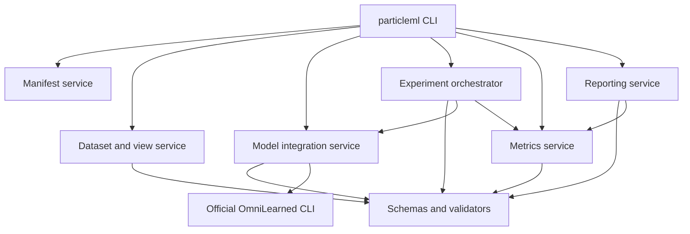
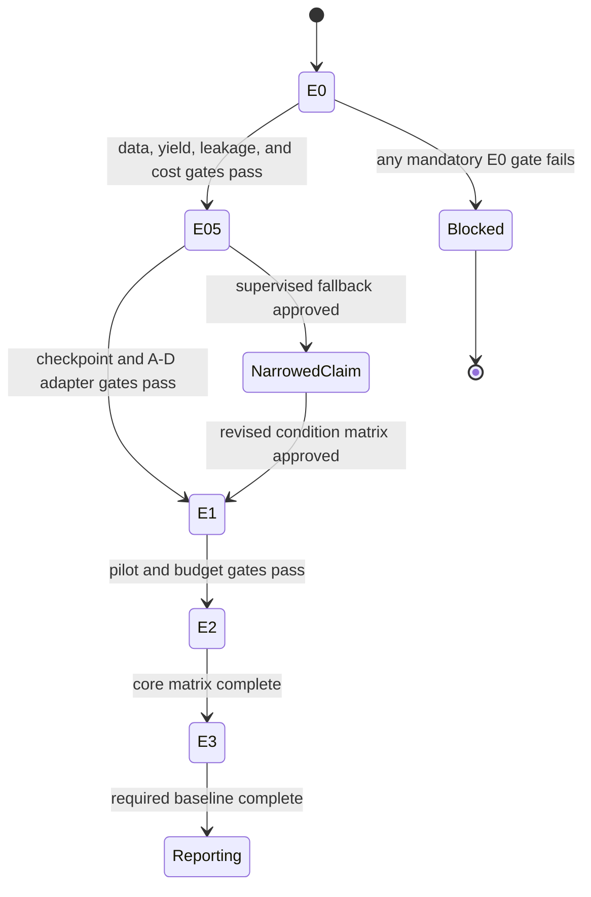

# particleML Software Architecture

## Document Control

| Field | Value |
|---|---|
| Status | Approved architecture baseline; implementation not yet verified |
| Document version | 1.1.0 |
| Software documentation suite | 1.1.0 |
| Research baseline | Research Plan v0.4.0 |
| Date | 2026-07-17 |
| Primary study | CMS 2015 top-versus-QCD feature-availability fine-tuning |

This is the single authoritative architecture for the publication-supporting
particleML system. The former engineering document is retained only as a link
to this file. Requirements are defined in the
[Software Requirements Specification](./requirements.md), and implementation
contracts are defined in the [Implementation Specification](./specification.md).

## 1. Architectural Scope

The system must answer one controlled research question:

> Under a fixed CMS 2015 top-versus-QCD fine-tuning protocol, how does nested
> particle-level feature availability affect a pretrained OmniLearned PET-style
> model?

The architecture supports E0 through E3 of
[Research Plan v0.4](../research/research-plan.md). Initial implementation is
limited to E0 and E0.5; later components become active only when their upstream
gates pass. The architecture does not certify that any gate, experiment, or
publication claim has passed.

Non-goals are PET reimplementation, foundation-model pretraining, a separate
JetClass production pipeline, distributed orchestration, online model serving,
a database, a web UI, or a broad model benchmark.

## 2. Architecture Decisions

| ID | Decision | Consequence |
|---|---|---|
| ADR-001 | Use one CMS-specific CMSSW extraction boundary and one modern Python ML boundary. | Old CMSSW dependencies cannot leak into the training environment. |
| ADR-002 | Produce one immutable canonical full-D dataset. | A-D differences are column availability, not sample or ordering differences. |
| ADR-003 | Use the exact UTF-8 PFN SHA-256 modulo-10 split from Research Plan v0.4. | Protocol prefixes and PFN text are not normalized; the committed manifest is part of the identity. |
| ADR-004 | Reuse the pinned official OmniLearned package through subprocess commands. | This repository owns adapters, validation, orchestration, records, metrics, and reports, but not PET internals. |
| ADR-005 | Treat OmniLearned custom-data indexing as a mandatory stage. | `omnilearned dataloader` runs before training and its output hash enters the run record. |
| ADR-006 | Use configuration-specific input adapters and a reinitialized binary head. | A-D input dimensionality is explicit; backbone loading is audited tensor by tensor. |
| ADR-007 | Make E0.5 select an allowed checkpoint/normalization policy; provide no silent default. | Incompatible pretraining narrows the claim or activates the supervised fallback. |
| ADR-008 | Use fixed, nested, class-balanced training subsets independent of model seeds. | A-D and model conditions compare the same selected jets. |
| ADR-009 | Keep a small Deep Sets/PFN implementation in-repository. | The required publication control does not depend on another training framework. |
| ADR-010 | Use schema-valid, content-addressed artifacts and explicit completion records. | Resume and aggregation cannot accept partial or stale output. |
| ADR-011 | Keep notebooks read-only consumers of package APIs. | No formal result depends on hidden notebook state. |

The architecture deliberately does not specify an undocumented `clip_inputs`
argument. External CLI flags are allowlisted against the pinned OmniLearned
revision; unsupported or conditional/global-input flags are rejected before a
formal run.

## 3. System Context and Execution Topology

```mermaid
flowchart LR
    Catalog["CERN Open Data records"] --> SourceManifest["Frozen source manifest"]
    EOS["CMS MINIAODSIM on EOS"] --> Extractor["CMSSW extractor"]
    SourceManifest --> Extractor
    Extractor --> FlatROOT["Compact flat ROOT"]
    FlatROOT --> Converter["Python conversion and audit"]
    Converter --> Canonical["Canonical full-D HDF5"]
    Canonical --> SplitManifest["Frozen split and subset manifest"]
    Canonical --> Views["Deterministic A-D views"]
    SplitManifest --> Views
    Views --> Indexer["OmniLearned dataloader/index"]
    Indexer --> Trainer["Pinned OmniLearned training"]
    Views --> Baseline["Deep Sets/PFN control"]
    Trainer --> Predictions["Aligned predictions"]
    Baseline --> Predictions
    Predictions --> Statistics["Metrics and paired bootstrap"]
    Statistics --> Reports["Tables, figures, claim eligibility"]
    SourceManifest --> Records["Provenance and run records"]
    Canonical --> Records
    Indexer --> Records
    Trainer --> Records
    Statistics --> Records
```



There are two production environments:

1. **Extraction:** pinned CMSSW 7.6.7 container on a POSIX host near EOS/XRootD.
2. **ML:** modern pinned Python environment on local CPU/small GPU for E0.5 and
   a measured single-GPU host for E1-E3.

Only frozen manifests and compact extracted artifacts cross the boundary. The
3.542 TiB candidate corpus is streamed selectively and is not mirrored to the
local workstation. Direct filesystem and HTTP/HTTPS access are used; no
intermediate web service participates in the data path.

## 4. Component Model



| Component | Owns | Must not own |
|---|---|---|
| CMSSW extractor | CMS object decoding, corrected-AK8 selection, daughter resolution, truth matching, raw fields, cutflow | HDF5 normalization, model code, statistics |
| Manifest service | Source-manifest parsing/hashing, exact-PFN split assignment, split/subset manifests | CMS decoding or model behavior |
| Dataset and view service | ROOT-to-HDF5 conversion, masks, feature transforms, training-only fitted state, A-D views, audits | PET layers or experiment scheduling |
| Model integration service | Checkpoint audit, adapter policy, OmniLearned index and command construction, layer-load audit | Official PET implementation or scientific reporting |
| Experiment orchestrator | Gate checks, immutable run directories, execution, resume, run/failure records | Metric definitions or hidden retries |
| Metrics service | Smoke checks, ROC/AUC, rejection, accuracy, paired bootstrap, data-efficiency statistics | Training or data extraction |
| Reporting service | Schema-valid aggregation, tables, figures, claim-eligibility state | Manual spreadsheet corrections or result invention |
| Contract validator | JSON Schema, cross-artifact hashes, semantic overlap/order checks | Scientific policy selection |
| CLI | Argument parsing and dependency wiring | Reusable scientific or business logic |

### 4.1 Target Repository Structure

The following is a target structure, not a statement of current implementation:

```text
particleML/
|-- cmssw/ParticleMLExtractor/
|   |-- BuildFile.xml
|   |-- plugins/ParticleMLExtractor.cc
|   `-- python/extract_cfg.py
|-- src/particleml/
|   |-- __init__.py
|   |-- cli.py
|   |-- manifest.py
|   |-- dataset.py
|   |-- views.py
|   |-- model_integration.py
|   |-- experiment.py
|   |-- metrics.py
|   |-- reporting.py
|   `-- contracts.py
|-- configs/
|-- schemas/
|-- tests/
|-- docs/software/
`-- pyproject.toml
```

No empty future modules are created merely to match this diagram. A module is
introduced with the first tested responsibility it owns. A minimal metrics
module is part of E0/E0.5 because leakage and tiny-fine-tune checks already need
metric behavior.

## 5. Data Architecture

### 5.1 Extraction Contract

The extractor reads the frozen CMS records and writes one compact ROOT file per
job. Each selected jet carries record ID, exact source PFN identity, run,
luminosity block, event, jet index, split, class label, corrected jet kinematics,
vertex diagnostics, ordered candidate features, mask/length, and cutflow
provenance. Generator truth is retained only in audit/provenance branches and
is excluded from model tensors.

The signal and background definitions, jet cuts, CMSSW release, container, and
global tag come directly from Research Plan v0.4. Missing products, unresolved
daughters, ambiguous top matches, and invalid decoded displacement values fail
closed.

### 5.2 Canonical Dataset

Conversion produces one content-addressed HDF5 dataset with a maximum of 150
constituents sorted by descending pT. The canonical particle feature order is:

```text
delta_eta, delta_phi, log_pt, log_energy, charge, pid_type,
dxy_raw, dxy_error_raw, dz_raw, dz_error_raw
```

The canonical dataset also stores a boolean mask, binary label, stable jet
identity, audit-only jet variables, source/split metadata, feature version, and
fitted-state hashes. Padding is zero with `mask=false`; zero is not used to infer
validity.

PID categories are based on `abs(pdgId)`: charged hadron 211, neutral hadron
130, photon 22, electron 11, muon 13, and unknown. Positive and negative species
map to the same category. D fields are zero for neutral candidates and charged
candidates without usable tracks, while separate counts distinguish those
cases. A charged no-track fraction above 1% blocks E1.

### 5.3 Split and Training Subsets

The split is determined before extraction from the exact manifest PFN. No
normalization of that string is allowed. Split manifests record file and event
counts, per-class jet counts, overlap checks, preprocessing identity, and the
hash of all selected training-subset identities.

Training subsets are nested and class-balanced. One frozen subset seed controls
identity selection; model seeds control only model initialization/training.
Signal identities are deterministically ranked. QCD identities are ranked
within active records and selected round-robin across sorted record IDs. The
same subset index is reused for every A-D and model condition.

### 5.4 Fitted State and Views

All normalization, pT/eta control, optional pileup reweighting, and approved
impact-parameter transforms are derived from training data only. E0.5 must
either reproduce the documented checkpoint convention or approve an explicit
training-only fitted transform. There is no ad hoc `tanh` fallback.

A-D views are immutable projections. Canonical storage keeps `charge` before
`pid_type`, while view construction deliberately reorders the native integer
PID to index 4 for the pinned OmniLearned interface:

| Configuration | `F` | Ordered fields | OmniLearned flags |
|---|---:|---|---|
| A | 4 | `delta_eta`, `delta_phi`, `log_pt`, `log_energy` | none |
| B | 5 | A + `charge` | `--use-add --num-add 1` |
| C | 6 | A + `pid_type` at index 4 + `charge` | `--use-pid --pid_idx 4 --use-add --num-add 1` |
| D | 10 | C + `dxy_raw`, `dxy_error_raw`, `dz_raw`, `dz_error_raw` | `--use-pid --pid_idx 4 --use-add --num-add 5` |

The project passes the integer PID column and continuous additional fields to
the pinned OmniLearned interface. It does not expand PID into project-owned
indicator columns in a materialized HDF5 view; any internal categorical
encoding remains an implementation detail of the pinned external package.

## 6. Model and Training Architecture

### 6.1 OmniLearned Process Boundary

The model integration service invokes the pinned official package in this
order:

```text
validate view -> build custom-data index -> hash index -> audit checkpoint
-> build allowlisted train command -> execute -> collect checkpoint/predictions
```

The index step is mandatory and invalidated by a view hash change. Command
construction rejects `--conditional`, `--num-cond`, undocumented flags, and
global inputs for the primary classifier. The OmniLearned `--size` argument, if
used, means model size; training sample size is controlled by the frozen view.

### 6.2 Checkpoint and Adapter Gate

The checkpoint is not identified by a mutable nickname alone. E0.5 records its
download/source URL or repository asset, immutable revision/tag, file name,
SHA-256, license, pretraining-corpus statement, input convention, and load
report. `pretrain_s` is only a candidate until that record passes.

Each configuration receives a newly initialized adapter and binary head. Every
shape-compatible non-input backbone tensor is loaded from the same checkpoint;
loaded, skipped, and mismatched tensors are recorded. E0.5 requires finite
forward/backward passes and decreasing tiny-fine-tune loss for all A-D.

If adapter replacement is impossible, E0.5 may approve fixed full-dimensional
neutralization. Otherwise, the system uses the same architecture with supervised
initialization and marks pretrained-transfer claims ineligible.

### 6.3 Orchestration and Gates



The orchestrator never auto-retries a failed formal run or silently drops a
condition. It records every attempt, validates its final record, and requires a
new run ID for changed inputs/configuration.

## 7. Evaluation and Evidence Architecture

Successful evaluations produce schema-valid metadata plus an NPZ, Parquet, or
HDF5 payload with stable ordered jet identities, binary targets, and signal
scores. Aggregation verifies identity equality before paired comparison.

The metrics service owns ROC AUC, background rejection at signal efficiencies
0.30 and 0.50, accuracy, paired AUC deltas, at least 1,000 fixed-seed paired
bootstrap replicates, seed variation, and the guarded `auc_gap_fraction`.

The reporting service consumes only validated run records and predictions. It
generates figures and tables reproducibly and exports an eligibility ledger
that links each candidate manuscript claim to passed gates and retained
artifacts. Planned, failed, and incomplete conditions remain visible.

## 8. Artifact Ownership and Lifecycle

Formal artifacts live under one configured artifact root outside the Git
working tree:

```text
<artifact-root>/<study-id>/
|-- manifests/
|-- canonical/
|-- views/
|-- audits/
|-- runs/<run-id>/
|-- predictions/
`-- reports/
```

Each writer follows `prepare -> write temporary -> validate -> hash -> publish
-> write COMPLETED.json`. Production POSIX filesystems may publish with atomic
rename inside one filesystem. Windows development must treat `COMPLETED.json`
as the authoritative completion marker. Consumers reject missing markers,
unknown schema versions, or hash mismatches.

The canonical dataset and split manifest are immutable. Derived views and
indices are reproducible and disposable when their inputs remain available.
Run records, failure logs, predictions, reports, and hashes are retained for
the paper's reproducibility period.

## 9. Failure Containment and Security Boundaries

| Failure class | Boundary and response |
|---|---|
| Source/product failure | Quarantine the file, retain a structured failure, and fail E0 if required coverage is lost. |
| Physics-contract failure | Stop the stage; do not guess a label, unit, transform, or threshold. |
| Data-integrity failure | Reject the artifact and every dependent artifact. |
| Checkpoint/integration failure | Stop E0.5 or activate only an explicitly approved claim-narrowing fallback. |
| Training failure | Preserve logs and a failed run record; do not auto-retry or aggregate it. |
| Metric/identity failure | Reject paired statistics and downstream reports. |
| Documentation/schema drift | Block release until prose, schemas, and traceability agree. |

The system processes public simulated data and does not require participant
data. Secrets, provider credentials, and temporary signed URLs must not enter
manifests, run records, or logs. Artifact paths are treated as local paths, not
as executable shell fragments; subprocesses use argument arrays without a
shell.

## 10. Verification and Conformance

Architecture conformance requires:

- one command can trace a training example to record, PFN, event, jet,
  extractor revision, preprocessing, split, and subset;
- one canonical dataset produces identity-equivalent A-D views;
- the mandatory OmniLearned index and checkpoint audits are recorded;
- notebooks contain no authoritative production logic;
- every attempted formal run has a schema-valid success or failure record;
- every successful evaluation has aligned, hashed predictions;
- E0/E0.5 failures block later phases or activate an explicit claim-narrowing
  decision; and
- the cross-document consistency validator passes.

Verification details and commands are specified in
[Implementation Specification](./specification.md), while requirement-to-test
and requirement-to-evidence mappings are maintained in the
[Traceability Matrix](./traceability-matrix.md).
