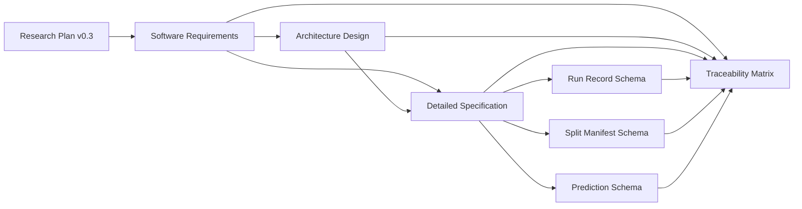

# particleML Software Documentation Suite Design

## Objective

Create a publication-grade software documentation suite for the particleML
research project. The suite must define the software needed to produce the
evidence for the paper described in `docs/plan/research-plan-v0.3.md`, while
clearly separating planned behavior from implemented behavior and completed
experimental results.

The documentation must make the following chain auditable:

```text
Research question
-> software requirement
-> architecture component
-> implementation contract
-> automated test
-> experiment artifact
-> figure or table
-> paper claim
```

## Audience

The primary audience is the project researcher implementing and operating the
JetClass feature-availability study. Secondary audiences are research
supervisors, collaborators, reviewers, and future maintainers who need to
reproduce the experimental evidence without relying on undocumented notebook
state.

## Approved Approach

Use a layered documentation system with four human-readable documents and
three machine-readable JSON Schemas. This approach was selected over a single
monolithic specification and over premature per-module micro-specifications.

The approved deliverables are:

```text
docs/software/
|-- requirements.md
|-- architecture.md
|-- specification.md
`-- traceability-matrix.md

schemas/
|-- run-record.schema.json
|-- split-manifest.schema.json
`-- prediction.schema.json
```

## Scope

The suite specifies the minimum publication-supporting system defined by
research plan v0.3:

- JetClass hadronic-top-versus-QCD binary classification.
- Nested particle-level feature configurations A through D.
- A pretrained OmniLearned PET-style primary model with an explicitly defined
  fallback when the checkpoint or adapter policy is incompatible.
- A fixed Deep Sets/PFN-style baseline for publication-strength controls.
- E0 data audit, E0.5 checkpoint spike, E1 pilot, E2 core matrix, and scoped E3
  controls.
- Deterministic experiment manifests, structured run records, saved per-event
  predictions, statistical evaluation, figures, and reproducibility evidence.

The suite does not specify a general multi-task foundation-model platform.
Generation, anomaly detection, likelihood-ratio estimation, external-dataset
transfer, a web interface, distributed training, and broad architecture
benchmarking remain outside the first publication-supporting implementation.

## Source-of-Truth Hierarchy

Conflicts are resolved in the following order:

1. `docs/plan/research-plan-v0.3.md` controls the scientific question, claim
   boundary, experimental matrix, and publication evidence.
2. `docs/software/requirements.md` controls required software behavior and
   acceptance criteria.
3. `docs/software/architecture.md` controls component boundaries, dependency
   direction, data flow, and execution topology.
4. `docs/software/specification.md` controls detailed interfaces, algorithms,
   data contracts, command behavior, and artifact layout.
5. Files under `schemas/` control machine validation of serialized artifacts.
6. `docs/software/traceability-matrix.md` records mappings among the sources of
   truth but does not override them.

If a machine-readable schema and prose disagree, the disagreement is a release
blocker. Neither source silently wins; both must be corrected in the same
change.

## Document Responsibilities

### Software Requirements Specification

`docs/software/requirements.md` defines what the software must do without
prescribing internal implementation details. It contains:

- purpose, scope, stakeholders, assumptions, and external constraints;
- numbered functional requirements grouped by data, preprocessing, models,
  training, orchestration, evaluation, reporting, and reproducibility;
- numbered non-functional requirements covering correctness, determinism,
  portability, performance observability, robustness, maintainability, and
  publication integrity;
- explicit exclusions and staged scope distinctions;
- acceptance criteria connected to the E0 through E3 gates; and
- requirement status values that distinguish specified, implemented,
  verified, and deferred work.

Requirement identifiers use stable prefixes such as `FR-DATA-001`,
`FR-TRAIN-001`, `NFR-REP-001`, and `AC-E0-001`. Identifiers are never reused
after deletion.

### Software Architecture Design

`docs/software/architecture.md` defines how the target system is decomposed. It
contains:

- system context and component diagrams in Mermaid;
- package responsibilities and allowed dependency directions;
- the data path from HDF5 sources through preprocessing, training,
  prediction, statistics, and paper figures;
- the control path for E0, E0.5, E1, E2, and E3;
- local-development and single-GPU cloud execution topologies;
- artifact ownership and lifecycle;
- checkpoint-adapter boundaries and fallback behavior;
- failure containment and restart boundaries; and
- architecture decisions that constrain the first implementation.

The architecture must use small, independently testable components and must
prevent notebooks from becoming the canonical production pipeline.

### Detailed Software Specification

`docs/software/specification.md` defines implementation-ready contracts. It
contains:

- proposed Python package and file layout;
- public module responsibilities and typed API signatures;
- tensor shapes, dtypes, mask semantics, and feature-configuration behavior;
- data discovery, hashing, split, normalization, and manifest algorithms;
- model adapter, checkpoint loading, and baseline contracts;
- command-line entry points, arguments, exit codes, and resume semantics;
- configuration precedence and validation;
- run-directory and artifact naming rules;
- metric definitions, bootstrap procedures, and numerical edge cases;
- error taxonomy and required failure records; and
- test layers and required validation commands.

Unknown JetClass physical columns are not guessed. The specification defines a
blocking E0 discovery and approval contract: a formal run cannot begin until
the selected source files, exact column mapping, units or transforms, mask
source, label rule, and normalization source are recorded and validated.

### Traceability Matrix

`docs/software/traceability-matrix.md` maps:

- RQ1 through RQ3 to software requirements;
- requirements to architecture components and detailed-spec sections;
- requirements to planned test files and acceptance checks;
- experiment gates to required artifacts;
- artifacts to planned figures, tables, and defensible paper claims; and
- deferred requirements to explicit future-work boundaries.

The matrix must never claim that a planned test, run, artifact, figure, or
paper result exists. Status values are `specified`, `implemented`, `verified`,
and `deferred`, with repository evidence required for the last two non-deferred
states.

## Machine-Readable Contracts

All schemas use JSON Schema Draft 2020-12, reject unknown properties at the
defined object boundary, and include stable `$id`, `title`, `description`, and
`schema_version` fields.

### Run Record Schema

`schemas/run-record.schema.json` validates the provenance and outcome of one
attempted experiment run. It includes the fields required by research plan
v0.3: identifiers, Git and data hashes, preprocessing version, checkpoint
source, feature configuration, model and initialization, seed, training size,
hyperparameters, adapter policy, layer-loading audit, hardware, timing, memory,
best epoch, metrics, prediction artifact, and failure status.

Conditional validation distinguishes successful and failed runs. A successful
run requires final metrics and a prediction artifact. A failed run requires a
non-empty failure code and message and may omit final metrics.

### Split Manifest Schema

`schemas/split-manifest.schema.json` validates a frozen dataset split. It
records source file hashes, dataset identity, split method and seed, event
identifiers or deterministic selection rules, per-split and per-class counts,
training-size subsets, preprocessing version, and manifest hash metadata.

The contract requires train, validation, and test partitions and supports a
deterministic-rule representation when enumerating every event identifier is
impractical. Split-overlap freedom remains a semantic validation performed by
code because JSON Schema alone cannot prove set disjointness.

### Prediction Schema

`schemas/prediction.schema.json` validates prediction-artifact metadata and the
logical record format used for statistical analysis. It records the run ID,
split-manifest hash, ordered event identifiers, binary targets, signal scores,
optional hard predictions, row count, dtype, storage encoding, and content
hash.

Large prediction arrays may be stored in NPZ, Parquet, or HDF5 rather than
embedded in JSON. The JSON contract describes and hashes the external payload;
format-specific readers must produce the same logical columns.

## Documentation Data Flow



## Consistency and Error Handling

The documentation suite treats the following as blocking defects:

- a requirement without an acceptance criterion or traceability row;
- a schema property not defined in the detailed specification;
- a required artifact named differently across documents;
- a Mermaid component not assigned a responsibility;
- a claim of implementation or verification without repository evidence;
- an unresolved placeholder marker or incomplete section;
- a guessed dataset column, checkpoint property, or experimental result; and
- a link to a missing repository file.

Discoverable values are represented as validated E0 or E0.5 outputs, not as
placeholders. For example, the exact Config D source columns are required
fields in the E0 data-audit artifact and are a gate for formal execution.

## Verification Strategy

The documentation implementation is complete only when:

1. all seven approved deliverables exist and are non-empty;
2. Markdown files contain the approved sections and use stable identifiers;
3. every JSON file parses and each schema identifies Draft 2020-12;
4. schemas contain no unresolved local or remote references;
5. schema property names match the detailed specification;
6. every software requirement appears in the traceability matrix;
7. all relative repository links resolve;
8. Mermaid blocks use valid, repository-renderable syntax;
9. a repository-wide placeholder scan reports no unresolved placeholders in
   the seven deliverables; and
10. the suite consistently marks the current implementation and experiment
    status as incomplete until code and evidence actually exist.

Verification must use local tools and direct filesystem or HTTP/HTTPS access;
it must not depend on an intermediate web service.

## Implementation Sequence

The documentation is produced in dependency order:

1. write the requirements and stable identifiers;
2. write the architecture against those requirements;
3. write the detailed specification against both documents;
4. create the three schemas from the detailed contracts;
5. build the traceability matrix after identifiers and artifact names stabilize;
6. run cross-document, schema, link, and placeholder validation; and
7. correct all blocking defects before declaring the suite complete.

## Publication Integrity Boundary

These documents specify the software and evidence that the paper requires.
They do not certify that the software has been implemented, that experiments
have run, or that a scientific result has been obtained. Publication claims
become eligible only after the associated requirement is implemented, its test
and experiment gates pass, the run artifacts are retained, and the
traceability matrix points to that evidence.
